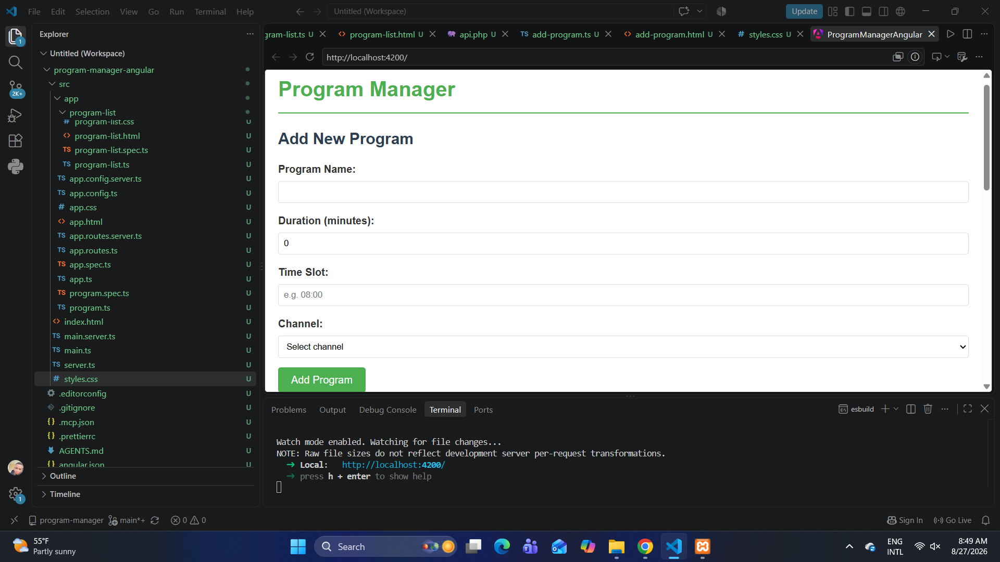
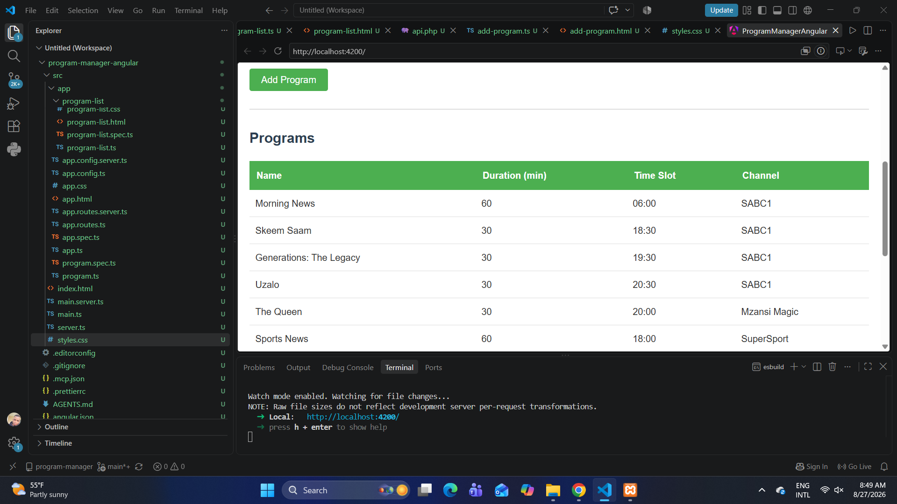

# 📺 Program Manager

## Description
This is a web-based application designed to help users manage and organize their favorite TV programs. It allows users to add, search, and view program details including channel, time slot, and duration.

## Features
- Add new TV programs with detailed information.
- Search and filter programs easily.
- View program details like channel, duration, and live broadcast status.
- Responsive and user-friendly interface.

## How to Run
1. Clone this repository to your local machine.
2. Open the `index.html` file in any modern web browser.
3. Start managing your TV programs!

## Technologies Used
- HTML5
- CSS3
- JavaScript (ES6)
- Git & GitHub (for version control)

## Author
**Name:** Thabang Rantoka  
**GitHub:** [ThabangRantoka](https://github.com/ThabangRantoka)

## Project Screenshots

### Add New Program

### Program List

### More Programs

